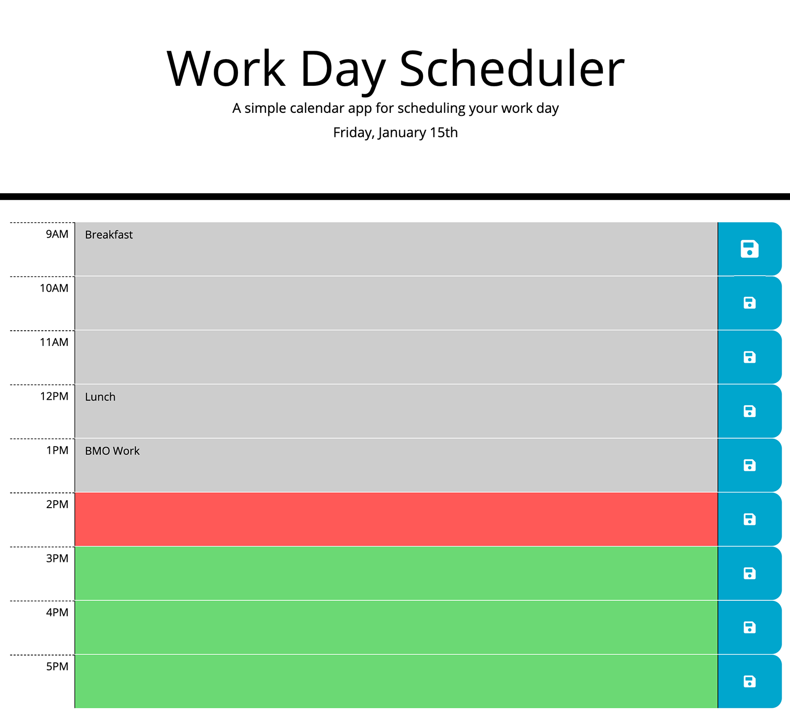

# Work Day Scheduler

## Description
1. After examining index.html file and CSS, I experimented with the layout in the index.html until I could mimic the rows of the schedule in the example. This involved some tweaking of the CSS. 
2. In the script.js file, I started creating the functions and variables to populate the page:
    1. scheduleItems: An array that loads the schedule info from local storage
    2. today: variable that stores today's date, grabbed and formatted by moment.js
    3. dateCheck(): Checks to see if the date saved in local storage is the same as today's date. If it is not, it resets the scheduleItems array to be empty. It then runs the buildSchedule() function.
    4. buildSchedule(): 
        * Saves todays date in local storage. 
        * Creates a variable called currentHour which (using moment.js) stores the current hour of the day. 
        * Declares other variables (meridiem to hold (AM/PM), textAreaClass declared as an empty string, and textAreaConents declared, but not assigned anything.
        * Runs through a for loop that starts with i = 9 and finishes when it = 17. It creates a row of the schedule that holds the hour from 9AM to 5PM, a \<textarea> with an id of "ta-" plus the time of the current line being created (ta-9, ta-10, ta-11, ta-12, ta-1, etc.) and text from the scheduleItems array if appropriate, adds a \<submit> with an event listener that will run the saveText() function when clicked.
    5. saveText(schedId): creates an array (scheduleItem) that holds the value of the id and contents of the \<textarea> that corresponds with the \<submit> that was clicked. Checks to see if the scheduleItems arrays already holds an array with the same id and splices it from scheduleItems if it does. Pushes the scheduleItem array to the scheduleItems array and then saves the scheduleItems array to local storage.

## Screenshot

## Link to webpage
[Work Day Scheduler](https://e-p-n.github.io/scheduler)

        